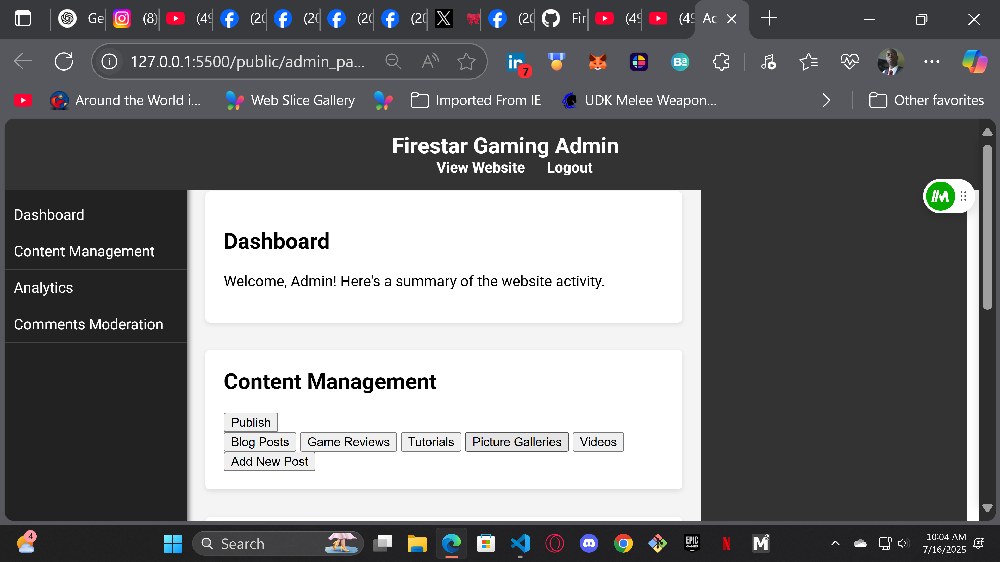
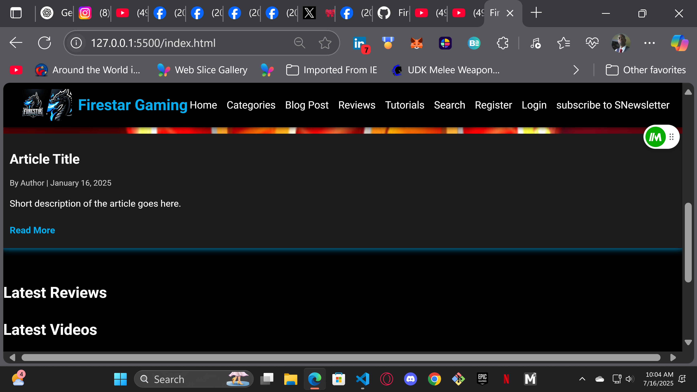

# FireStar Blog Site

## Overview
A full-stack blogging platform designed for gaming content creators. Features secure user authentication, dynamic content management, and a responsive front-end built with React. The back-end is powered by Node.js, Express, and MongoDB with robust security practices.

---

## Features
✅ User registration and secure login with hashed passwords  
✅ JWT-based authentication and authorization  
✅ Create, edit, and delete blog posts with image uploads (Multer)  
✅ Rich content management for gaming news and reviews  
✅ Email notifications via Nodemailer  
✅ MongoDB integration with Mongoose  
✅ Security middleware (Helmet, CSRF protection, rate limiting, XSS clean)  
✅ WebSockets support for future real-time features  
✅ Responsive UI built in React

---
Screenshots 
---

## Screenshots

### 🖼️ Login Page


### 🖼️ Blog List


### 🖼️ Post Creation Form


### 🖼️ Admin / Dashboard View



## Tech Stack

**Front-End:**  
- React.js, React Router, Axios, Ant Design, JavaScript (ES6+)

**Back-End:**  
- Node.js, Express.js
- MongoDB with Mongoose
- bcrypt/bcryptjs, JSON Web Tokens for authentication
- Multer for file uploads
- Nodemailer for email
- Helmet, express-rate-limit, csurf, xss-clean for security
- WebSockets (ws)

---

## Installation

### 1️⃣ Clone the repository
```bash
git clone https://github.com/cejohns/FireStarGamingBlog.git
cd FireStarGamingBlog
